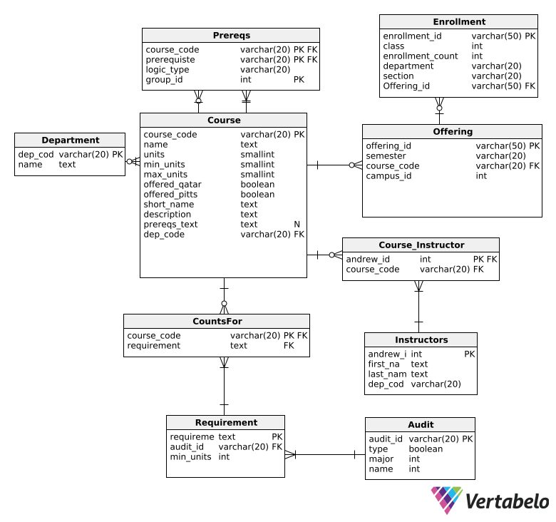

# GenEd Backend

This directory contains the Python FastAPI backend application for the GenEd project. It handles data processing, provides API endpoints, and interacts with the database.

---

## Getting Started

### Prerequisites

* Python (3.8+ recommended - Check `requirements.txt`)
* pip
* virtualenv (recommended)

### Setup

1. **Navigate to the backend directory:**
   ```bash
   cd path/to/GenEd-CMUQ/backend
   ```
2. **Create and activate a virtual environment:**
   ```bash
   python -m venv venv
   source venv/bin/activate  # On Windows use `venv\Scripts\activate`
   ```
3. **Install dependencies:**
   ```bash
   pip install -r requirements.txt
   ```

---

## Database

Below is the Entity Relationship Diagram (ERD) for the database:



* **Database File:** The application uses a SQLite database. By default, it expects the database file to be at `backend/database/gened_db.sqlite`. This path can be overridden by setting the `DATABASE_URL` environment variable.
* **Models:** Database table structures are defined using SQLAlchemy ORM in `backend/database/models.py`.

---

## Data Extraction

Data for courses, enrollment, and degree audits is extracted from source files (JSON and Excel) using specialized extractor classes located in `backend/scripts/`:

* `course_extractor.py`: Processes course information JSON files.
* `enrollment_extractor.py`: Processes enrollment data from Excel files.
* `audit_extractor.py`: Processes degree audit requirement JSON files.

These scripts parse the raw data and transform it into a structure suitable for database insertion.

### Audit Data Extraction Source

* The logic for extracting data from degree audit JSON files (`backend/scripts/audit_extractor.py`) is based on the work done in the [cs-cmuq/courses-data-analysis](https://github.com/cs-cmuq/courses-data-analysis) repository.
* Specifically, it adapts the logic found in the `audits.ipynb` notebook: [https://github.com/cs-cmuq/courses-data-analysis/blob/master/audits.ipynb](https://github.com/cs-cmuq/courses-data-analysis/blob/master/audits.ipynb)

---

## Data Loading

Once extracted, the data needs to be loaded into the database. There are two primary methods for this:

### 1. Using the Frontend Upload Feature (Maintainer Access)

* Maintainers can access a dedicated data upload interface via a specific URL path. This path is configured in the frontend environment using the `REACT_APP_UPLOAD_PATH` variable.
* On this page, maintainers can upload the source data files (Course ZIPs, Audit ZIPs, Enrollment Excel, Department CSV).
* The frontend then sends these files to the backend API (specifically the `/upload/init-db/` endpoint), which triggers the appropriate extractor scripts (`backend/scripts/*_extractor.py`) and saves the resulting data to the database.

### 2. Using Python Modules (Manual)

* Alternatively, data can be loaded directly by executing the database modules from the command line. This is typically done after resetting the database.
* **Steps:**
  1. Ensure your virtual environment is activated (`source venv/bin/activate`).
  2. Navigate to the project's root directory (`GenEd-CMUQ`).
  3. Optionally, reset the database (clears all existing data):
     ```bash
     python -m backend.database.reset_db
     ```
  4. Load the data by running the `load_data` module. This script will likely look for data files in predefined locations (e.g., within the `data/` directory):
     ```bash
     python -m backend.database.load_data
     ```
  5. This executes the main logic within `backend/database/load_data.py`, which uses the extractor classes to parse data and populate the database tables.

---

## Running the Backend Server

Start the FastAPI development server using Uvicorn:

```bash
uvicorn backend.app.main:app --reload --host 0.0.0.0 --port 8000
```

* `--reload`: Enables auto-reloading when code changes.
* `--host 0.0.0.0`: Makes the server accessible on your local network.
* `--port 8000`: Specifies the port number.

The API will be accessible at `http://127.0.0.1:8000` (or `http://<your-local-ip>:8000`).

---

## API Documentation

Once the server is running, interactive API documentation is available:

* **Swagger UI:** `http://127.0.0.1:8000/api/docs`
* **ReDoc:** `http://127.0.0.1:8000/api/redoc`

---

## Running Tests

Backend tests are located within the `backend/tests/` directory and are run using `pytest` from the project root directory (`CountsFor/`).

```bash
# Navigate to the project root directory (e.g., CountsFor/)
# Ensure your backend virtual environment is activated if needed

# Run all backend tests
python -m pytest backend/tests
```

For more detailed information on the test structure and how to run specific tests (e.g., targeting specific files or functions), see the [`tests/README.md`](tests/README.md) file within this backend directory.

---

## Project Structure

* The backend follows a **layered architecture** to ensure clean separation of concerns:

  ```
  backend/
  │
  ├── app/                # Contains the FastAPI application setup, routers, and schemas.
  │   ├── routers/        # API route definitions (endpoints).
  │   ├── schemas.py      # Pydantic models for data validation and serialization.
  │   └── main.py         # FastAPI app entry point and middleware configuration.
  │
  ├── database/           # Handles database connection, models, and initialization.
  │   ├── models.py       # SQLAlchemy ORM models defining database tables.
  │   └── db.py           # Database connection setup and session management.
  │
  ├── repository/         # Data Access Layer: Interacts directly with the database.
  │   └── ...             # Example: courses.py for course-related queries.
  │
  ├── services/           # Business Logic Layer: Processes data between API and repository.
  │   └── ...             # Example: courses.py for course-related business logic.
  │
  ├── scripts/            # Utility scripts for data extraction, population, etc.
  │   └── ...
  │
  ├── tests/              # Contains automated tests for the backend.
  │   ├── database/
  │   ├── routers/
  │   ├── services/
  │   └── README.md       # Detailed guide for running backend tests.
  │
  ├── docs/               # Documentation files, including images.
  │   └── images/         # Contains images like the ERD.
  │
  ├── requirements.txt    # Python package dependencies.
  └── README.md           # This file.
  ```

## Layered Architecture Explained

The backend is designed with  **three layers** :

1. **API Layer (`routers/`)**
   * Exposes REST API endpoints using  **FastAPI** .
   * Calls the **service layer** for business logic.
   * Ensures validation using  **Pydantic schemas** .
2. **Service Layer (`services/`)**
   * Implements **business logic** (e.g., structuring responses, processing data).
   * Calls the **repository layer** for data access.
   * Ensures consistency and formatting before returning responses.
3. **Repository Layer (`repository/`)**
   * Directly interacts with the **database** using  **SQLAlchemy** .
   * Contains **raw queries** and fetches data  **without processing it** .
   * Called by the **service layer** to retrieve structured data.
